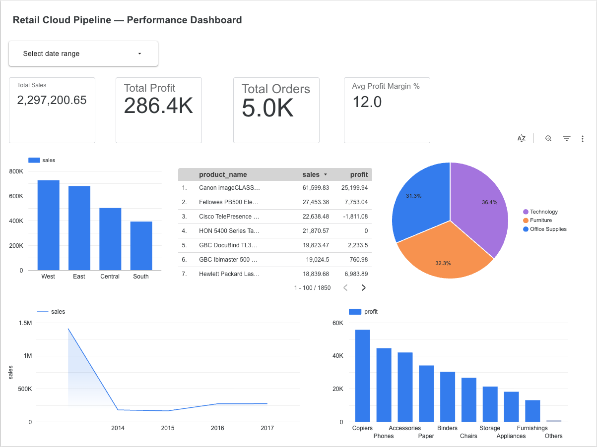

# Retail Cloud Pipeline — Performance Dashboard

An end-to-end retail data pipeline built using Python ETL, 
Google BigQuery, and Looker Studio. This project demonstrates 
a complete data engineering and analytics workflow from raw 
data ingestion through to interactive business dashboard.

---

## Live Dashboard

[View Interactive Dashboard](https://datastudio.google.com/s/uqvS0ilg0SY)

---

## Project Overview

| Component | Tool Used |
|---|---|
| Data Source | Superstore Retail Dataset (9,994 rows) |
| ETL Pipeline | Python (Pandas, NumPy) |
| Cloud Data Warehouse | Google BigQuery |
| Dashboard | Looker Studio |
| SQL Analysis | BigQuery SQL |

---

## Key Business Insights

- **West region** leads in total sales at £700K+
- **Technology** is the top category at 36.4% of total sales
- **Copiers** are the most profitable sub-category at £55K+ profit
- **Canon imageCLASS** is the top product with £61,599 sales 
  and £25,199 profit
- **12% average profit margin** across all 5,009 orders
- **793 unique customers** across 4 regions

---

## Pipeline Architecture

Raw CSV Dataset (Kaggle Superstore)
↓
Python ETL Script (extract, clean, transform)
↓
Google BigQuery (cloud data warehouse)
↓
Looker Studio Dashboard (interactive reporting)

---

## ETL Process

The Python ETL script (`scripts/etl_pipeline.py`) performs:

- **Extract** — loads raw CSV data
- **Transform** — removes duplicates, fixes data types, 
  standardises column names, adds calculated fields:
  - Profit margin %
  - Days to ship
  - Sales band (High / Medium / Low)
  - Profitability flag
- **Validate** — runs data quality checks
- **Load** — exports clean CSV for BigQuery upload

---

## SQL Analysis Queries

Six analytical queries written in BigQuery SQL 
(`SQL/analysis_queries.sql`):

1. Overall business performance summary
2. Sales and profit by region
3. Sales by category and sub-category
4. Customer segment performance
5. Monthly sales trend
6. Top 10 most profitable products

---

## Dashboard Features

- 4 KPI scorecards — Total Sales, Total Profit, 
  Total Orders, Avg Profit Margin
- Sales by Region bar chart
- Sales by Category pie chart
- Yearly sales trend line chart
- Top products performance table
- Profit by sub-category bar chart
- Interactive date range filter

---

## Tools and Technologies

- **Python** — Pandas, NumPy
- **Google BigQuery** — cloud data warehouse and SQL analysis
- **Looker Studio** — interactive dashboard
- **SQL** — data analysis and aggregation
- **GitHub** — version control and project documentation

---

## Author

**Vinit Bhalerao**  
Data Analyst | SQL | Python | Power BI | BigQuery  
[LinkedIn](https://www.linkedin.com/in/bhalerao-vinit3013) | 
[Portfolio](https://vinitbportfolio.netlify.app)