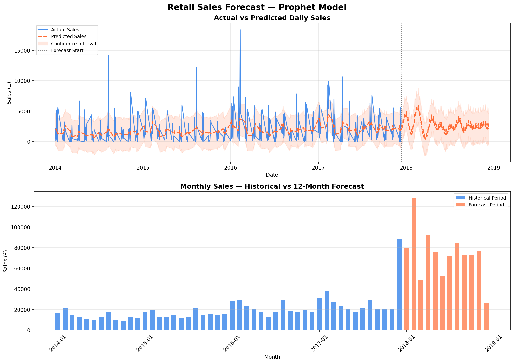

# Retail Cloud Pipeline — Performance Dashboard

An end-to-end retail data pipeline built using Python ETL, 
Google BigQuery, and Looker Studio — extended with ML sales 
forecasting using Facebook Prophet.

---

## Live Dashboard

[View Interactive Dashboard](https://datastudio.google.com/s/uqvS0ilg0SY)

---

## ML Forecasting — Prophet Model (Page 2)

---

## Project Overview

| Component | Tool Used |
|---|---|
| Data Source | Superstore Retail Dataset (9,994 rows) |
| ETL Pipeline | Python (Pandas, NumPy) |
| Cloud Data Warehouse | Google BigQuery |
| Dashboard | Looker Studio |
| SQL Analysis | BigQuery SQL |
| ML Forecasting | Python Prophet |

---

## Key Business Insights

- **West region** leads in total sales at £700K+
- **Technology** is the top category at 36.4% of total sales
- **Copiers** are the most profitable sub-category at £55K+ profit
- **Canon imageCLASS** is the top product with £61,599 sales and £25,199 profit
- **12% average profit margin** across all 5,009 orders
- **793 unique customers** across 4 regions

---

## ML Forecasting Results

- **Model:** Facebook Prophet with yearly and weekly seasonality
- **Training data:** 2014–2017 historical retail sales
- **Forecast period:** 12 months (2018)
- **Total predicted sales:** £881,738
- **Predicted growth:** +269.7% vs historical monthly average
- **Peak month:** February 2018
- **Confidence intervals:** upper and lower bounds generated for all predictions

---

## Pipeline Architecture

Raw CSV Dataset (Kaggle Superstore)
↓
Python ETL Script (extract, clean, transform)
↓
Google BigQuery (cloud data warehouse)
↓
BigQuery SQL Analysis (6 analytical queries)
↓
Looker Studio Dashboard (Page 1 — Performance)
↓
Prophet ML Model (12-month forecasting)
↓
Looker Studio Dashboard (Page 2 — Sales Forecast)
---

## ETL Process

The Python ETL script (`scripts/etl_pipeline.py`) performs:

- **Extract** — loads raw CSV data
- **Transform** — removes duplicates, fixes data types, standardises column names, adds calculated fields:
  - Profit margin %
  - Days to ship
  - Sales band (High / Medium / Low)
  - Profitability flag
- **Validate** — runs data quality checks
- **Load** — exports clean CSV for BigQuery upload

---

## Forecasting Process

The Prophet forecasting script (`scripts/forecasting_model.py`) performs:

- **Load** — reads cleaned retail data from CSV
- **Prepare** — aggregates daily sales time series
- **Train** — fits Prophet model with yearly and weekly seasonality
- **Forecast** — generates 12-month predictions with confidence intervals
- **Export** — saves forecast CSV for BigQuery upload
- **Visualise** — generates actual vs predicted chart with confidence bands

---

## SQL Analysis Queries

Six analytical queries written in BigQuery SQL (`SQL/analysis_queries.sql`):

1. Overall business performance summary
2. Sales and profit by region
3. Sales by category and sub-category
4. Customer segment performance
5. Monthly sales trend
6. Top 10 most profitable products

---

## Dashboard Features

**Page 1 — Performance Dashboard:**
- 4 KPI scorecards — Total Sales, Total Profit, Total Orders, Avg Profit Margin
- Sales by Region bar chart
- Sales by Category pie chart
- Yearly sales trend line chart
- Top products performance table
- Profit by sub-category bar chart
- Interactive date range filter

**Page 2 — Sales Forecast:**
- Actual vs predicted sales line chart (2014–2018)
- 12-month forecast with confidence intervals
- Total Predicted Sales scorecard
- Average Monthly Forecast scorecard
- Interactive date range filter

---

## Tools and Technologies

- **Python** — Pandas, NumPy, Prophet, Matplotlib
- **Google BigQuery** — cloud data warehouse and SQL analysis
- **Looker Studio** — interactive 2-page dashboard
- **SQL** — data analysis and aggregation
- **GitHub** — version control and project documentation

---

## Repository Structure

retail-cloud-pipeline/
│
├── data/
│   ├── superstore.csv              (raw dataset)
│   ├── superstore_cleaned.csv      (ETL output)
│   ├── sales_forecast.csv          (daily forecast)
│   └── monthly_forecast.csv        (monthly forecast)
│
├── scripts/
│   ├── etl_pipeline.py             (ETL script)
│   └── forecasting_model.py        (Prophet ML script)
│
├── SQL/
│   └── analysis_queries.sql        (BigQuery queries)
│
├── Dashboard/
│   ├── dashboard_screenshot.png    (Page 1 screenshot)
│   └── forecast_chart.png          (Page 2 forecast chart)
│
└── README.md

---

## Author

**Vinit Bhalerao**  
Data Analyst | SQL | Python | Power BI | BigQuery | ML Forecasting  
[LinkedIn](https://www.linkedin.com/in/bhalerao-vinit3013) | 
[Portfolio](https://vinitbportfolio.netlify.app)